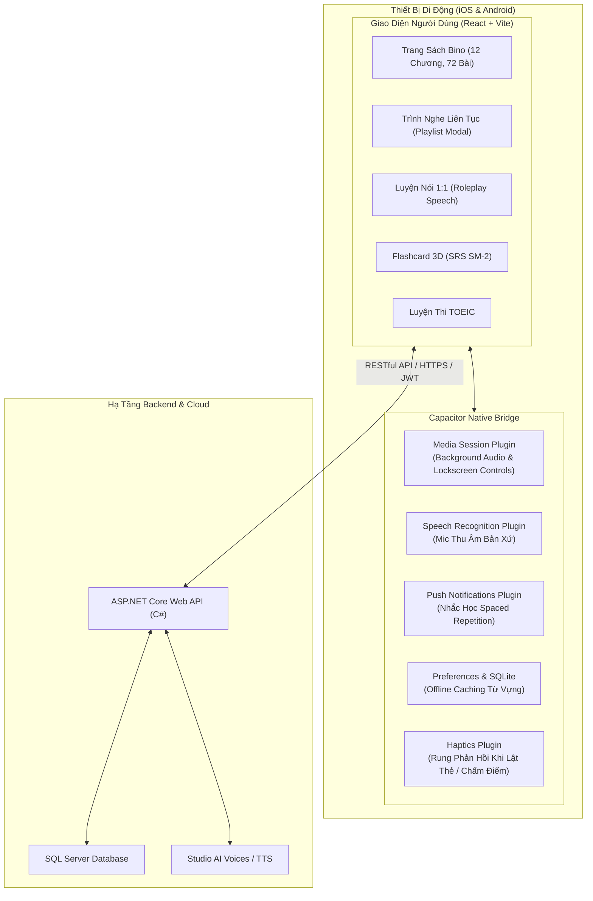
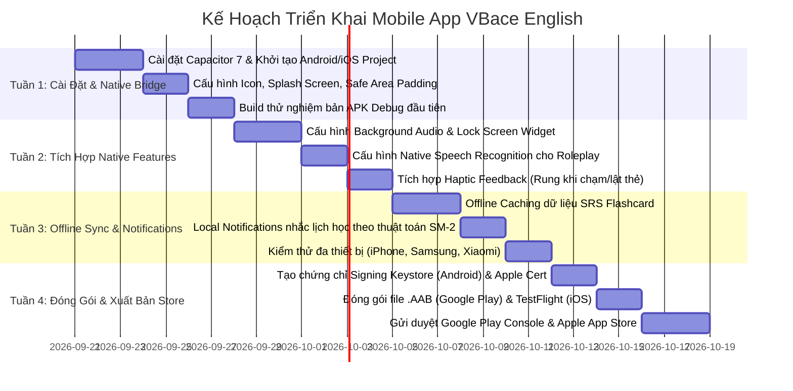

# KẾ HOẠCH & GIẢI PHÁP PHÁT TRIỂN MOBILE APP CHO DỰ ÁN VBACE ENGLISH
*(Luyện Thi TOEIC & Sách Bino "Chém Tiếng Anh Không Cần Động Não")*

---

## 📌 TỔNG QUAN DỰ ÁN & BỐI CẢNH HIỆN TẠI

Dự án **VBace English** hiện sở hữu kiến trúc hoàn chỉnh và mạnh mẽ:
1. **Backend**: ASP.NET Core Web API (C# .NET), Entity Framework Core, SQL Server, JWT Authentication, Swagger API đầy đủ cho toàn bộ nghiệp vụ (TOEIC, Sách Bino, SRS Spaced Repetition, Lộ trình học viên, Quản trị Admin).
2. **Frontend Web**: Xây dựng trên nền tảng **React (Vite) + Tailwind CSS v4 + Framer Motion**, vừa được tối ưu hóa:
   - **Mobile Responsive 100%**: Trải nghiệm vuốt chạm (Horizontal Swipe Carousel, Bottom Sheets, Media Toolbar ngón cái).
   - **Âm thanh & Giọng nói**: Web Speech API, Studio Neural AI Voices, Luyện phản xạ 1:1, Trình nghe liên tục Playlist (lặp vô hạn / theo số lần).
   - **Thuật toán học tập**: Spaced Repetition (SRS SM-2) với thẻ Flashcard 3D lật 180 độ.

**Mục tiêu**: Lựa chọn **giải pháp tốt nhất** để đưa hệ thống lên **App Store (iOS)** và **Google Play Store (Android)** với chi phí tối ưu nhất, thời gian đưa ra thị trường (time-to-market) nhanh nhất nhưng vẫn đảm bảo trải nghiệm người dùng đạt chuẩn Native mượt mà, ổn định.

---

## ⚖️ MA TRẬN SO SÁNH CÁC PHƯƠNG ÁN LÀM MOBILE APP

| Tiêu Chí Đánh Giá | Phương Án 1: CAPACITOR (Native Shell) ⭐ **Khuyến Nghị Số 1** | Phương Án 2: REACT NATIVE / EXPO | Phương Án 3: FLUTTER (Dart) | Phương Án 4: PWA (Progressive Web App) |
| :--- | :--- | :--- | :--- | :--- |
| **Mức độ tái sử dụng code Web** | **90% - 95%** (Dùng lại toàn bộ React + Tailwind + Framer Motion) | **40% - 50%** (Chỉ dùng lại logic API & State; phải viết lại toàn bộ giao diện) | **0%** (Phải code mới 100% bằng ngôn ngữ Dart) | **100%** (Chạy trực tiếp từ trình duyệt) |
| **Thời gian ra mắt (Time to Market)** | **1 - 2 Tuần** ⚡ (Nhanh nhất) | **1.5 - 2.5 Tháng** | **3 - 4 Tháng** | **3 - 5 Ngày** |
| **Chi phí phát triển & Nhân sự** | **Thấp nhất** (Tận dụng nguyên vẹn kỹ năng React hiện có) | **Trung bình - Cao** (Cần chuyển đổi JSX HTML sang Native Components) | **Cao nhất** (Cần lập trình viên thạo Flutter/Dart) | **Thấp nhất** |
| **Phát âm thanh nền (Background Audio / Lock Screen)** | **Hoàn hảo** (Qua `@capacitor-community/media-session`) | **Rất tốt** (Qua `react-native-track-player`) | **Rất tốt** (Qua `just_audio`) | **Rất kém trên iOS** (Bị hệ thống ngắt khi khóa màn hình) |
| **Micro & Nhận diện giọng nói Native** | **Rất tốt** (Gọi trực tiếp Android SpeechRecognizer / iOS Speech Framework) | **Rất tốt** (Native Voice) | **Rất tốt** (Speech_to_text) | Phụ thuộc Webkit của Safari |
| **Phân phối App Store & CH Play** | **Đầy đủ** (File .apk/.aab và .ipa chính thức) | **Đầy đủ** | **Đầy đủ** | Không có (Hoặc rất hạn chế) |
| **Hiệu năng & Animation** | **60fps mượt mà** (Nhờ Framer Motion + WebGL acceleration) | **60 - 120fps Native** | **60 - 120fps Native** | Trung bình |

---

## 🏆 ĐỀ XUẤT GIẢI PHÁP TỐT NHẤT: CHIẾN LƯỢC 2 BƯỚC

### 🎯 BƯỚC 1: XÂY DỰNG NGAY BẰNG CAPACITOR 7 + VITE (TRIỂN KHAI TRONG 1 - 2 TUẦN)
Đây là **giải pháp thông minh nhất** ở thời điểm hiện tại vì:
1. **Tiết kiệm 80% thời gian & chi phí**: Frontend của bạn vừa được chúng ta nâng cấp toàn bộ giao diện Mobile-first tuyệt đẹp, có sẵn Framer Motion, thẻ Flashcard 3D và font Be Vietnam Pro sắc nét. Không có lý do gì phải đập đi xây lại từ đầu bằng React Native hay Flutter!
2. **Khả năng Native thực thụ**: Capacitor không phải là "webview thông thường" thời xưa (Cordova), mà là kiến trúc **Native Bridge hiện đại** của Ionic. Nó cho phép code JavaScript gọi trực tiếp API phần cứng của điện thoại (Camera, Mic, Loa, Background Service, Push Notification, SQLite).
3. **Độc lập nền tảng**: Cùng một lúc xuất bản ra:
   - Bản Web: `http://localhost:4100` (dành cho máy tính/laptop)
   - Bản Android App: `VBaceEnglish.apk` / Google Play Bundle `.aab`
   - Bản iOS App: Xcode project chạy trên iPhone/iPad và App Store.

---

## 🏗️ KIẾN TRÚC HỆ THỐNG MOBILE APP (CAPACITOR NATIVE BRIDGE)



---

## 🛠️ GIẢI QUYẾT 4 BÀI TOÁN "SỐNG CÒN" CỦA APP HỌC TIẾNG ANH

### 1. Phát Âm Thanh Khi Tắt Màn Hình (Background Audio & Lock Screen Player)
- **Vấn đề**: Người học tiếng Anh thường khóa màn hình điện thoại hoặc đút túi quần khi đi xe bus, chạy bộ, làm việc nhà để nghe ngấm (Shadowing/Passive listening). Trình duyệt Web sẽ tự động ngắt âm thanh sau 30 giây khi màn hình tắt.
- **Giải pháp Capacitor**:
  - Tích hợp `@capacitor-community/media-session` và background audio mode trong Android Manifest & iOS Info.plist (`UIBackgroundModes: audio`).
  - Hiển thị đầy đủ **Widget âm nhạc trên màn hình khóa (Lock Screen)** và trung tâm điều khiển (Control Center):
    - Tên bài: *Hội thoại 3: Chào hỏi & Làm quen*
    - Ca sĩ/Tác giả: *Bino & Bạn bè*
    - Nút bấm: *Phát/Tạm dừng, Bài kế tiếp, Lặp lại*.

### 2. Micro Thu Âm & Luyện Phản Xạ 1:1 (Speech-to-Text)
- **Vấn đề**: Web Speech API trên trình duyệt di động (nhất là Safari iOS) hay bị lỗi chặn quyền truy cập Micro hoặc không ổn định.
- **Giải pháp Capacitor**:
  - Tích hợp `@capacitor-community/speech-recognition`. Plugin này gọi trực tiếp **Apple Speech Framework (iOS)** và **Google Speech Recognizer (Android)**.
  - Tốc độ chuyển giọng nói thành văn bản cực nhạy, hỗ trợ nhận diện phát âm tiếng Anh chuẩn xác (en-US) ngay cả khi mạng yếu.

### 3. Học Offline & Lưu Trữ Đệm (Offline Caching)
- **Vấn đề**: Mất mạng hoặc vào vùng sóng yếu không tải được bài học.
- **Giải pháp Capacitor**:
  - Sử dụng `@capacitor/preferences` kết hợp IndexedDB/SQLite cục bộ.
  - Tự động tải trước (Prefetch) dữ liệu câu thoại song ngữ và âm thanh của chương đang học. Người dùng có thể học từ vựng Flashcard SRS mọi lúc mọi nơi mà không cần Internet.

### 4. Nhắc Lịch Học Thông Minh (Push Notifications)
- **Vấn đề**: Người học tiếng Anh rất dễ bỏ quên chuỗi học (streak).
- **Giải pháp Capacitor**:
  - Tích hợp `@capacitor/local-notifications` và Firebase Cloud Messaging (FCM).
  - Tự động quét các từ vựng đến hạn ôn theo thuật toán **Spaced Repetition (SM-2)** để gửi thông báo vào đúng khung giờ người dùng rảnh rỗi (ví dụ 8h tối):
    > *"Hôm nay bạn có 8 từ vựng Bino cần ôn tập để không bị quên vào vùng trí nhớ dài hạn. Vào học ngay nhé!"*

---

## 📅 LỘ TRÌNH TRIỂN KHAI CHI TIẾT THEO TUẦN (4 TUẦN TỪ A - Z)



---

## 💻 HƯỚNG DẪN CÁC LỆNH KỸ THUẬT TRIỂN KHAI NGAY

### Bước 1: Cài đặt Capacitor vào dự án Frontend hiện tại
```bash
cd Frontend
npm install @capacitor/core @capacitor/cli @capacitor/android @capacitor/ios
npx cap init "VBace English" "com.vbace.english" --web-dir "dist"
```

### Bước 2: Thêm nền tảng Android & iOS
```bash
npm run build
npx cap add android
npx cap add ios
```

### Bước 3: Cài đặt các Native Plugin chuyên sâu
```bash
# Plugin âm thanh nền & widget màn hình khóa
npm install @capacitor-community/media-session

# Plugin nhận diện giọng nói native
npm install @capacitor-community/speech-recognition

# Plugin nhắc nhở thông báo & rung phản hồi
npm install @capacitor/local-notifications @capacitor/haptics @capacitor/preferences
```

### Bước 4: Tự động đồng bộ và mở trong Android Studio / Xcode
```bash
npm run build
npx cap sync
npx cap open android   # Mở dự án trong Android Studio để build file APK
npx cap open ios       # Mở dự án trong Xcode để chạy Simulator iPhone
```

---

## 📋 CHECKLIST TÀI NGUYÊN CẦN CHUẨN BỊ CHO STORE

1. **Tài nguyên hình ảnh đồ họa**:
   - **App Icon**: Kích thước `1024 x 1024 px` (PNG không trong suốt).
   - **Splash Screen**: Màn hình chờ mở app có logo VBace English sang trọng.
   - **Ảnh chụp màn hình (Screenshots)**: 5 - 6 ảnh chụp các tính năng hot (Hội thoại Bino, Luyện 1:1, Flashcard 3D, TOEIC Radar) chèn mockup điện thoại.
2. **Tài khoản nhà phát triển (Developer Accounts)**:
   - **Google Play Console**: Phí 25$ trả một lần duy nhất trọn đời.
   - **Apple Developer Program**: Phí 99$/năm (cần nếu muốn đưa lên App Store chính thức cho iPhone).
3. **Chính sách quyền riêng tư (Privacy Policy)**:
   - Một trang tĩnh mô tả ứng dụng sử dụng quyền Micro (chỉ dùng nhận diện luyện nói), Quyền thông báo (nhắc học).

---

## 🎯 KẾT LUẬN

Giải pháp **Capacitor 7 Native Shell** là **lựa chọn tối ưu số 1** tuyệt đối cho dự án VBace English:
- Giữ trọn vẹn 100% công sức đã làm trên web.
- Có ngay App Android và iOS chuyên nghiệp chỉ sau **7 - 10 ngày**.
- Đầy đủ tính năng cao cấp: Nghe audio tắt màn hình, Mic nhận diện phản xạ, rung cảm ứng Haptic, thông báo nhắc học.
- Chi phí rẻ nhất và bảo trì dễ nhất (1 codebase chạy đồng thời Web, Android và iOS).
